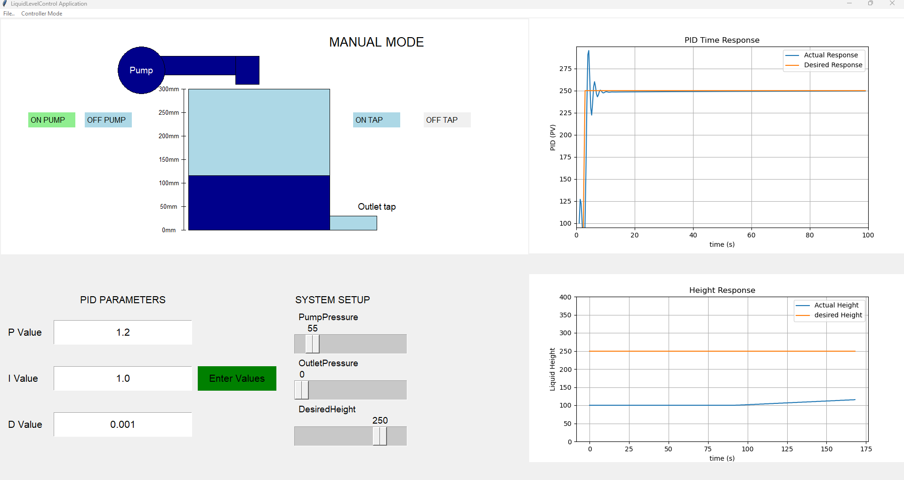
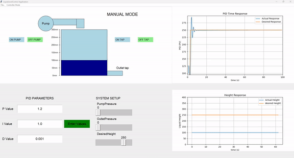

# LiquidTankPID: A PID Controller for Liquid Level Management



## Overview

LiquidTankPID is a Python application that implements a PID controller to manage the liquid level in a tank. The application features a graphical user interface (GUI) built with Tkinter, allowing users to visualize the PID time response plot and the height of the liquid in the tank. Users can set and adjust various parameters to observe the effects on the system's behavior.

## Features

- **PID Controller Visualization:** The application displays the PID time response plot, showing how the liquid level responds over time.
- **Liquid Level Visualization:** The height of the liquid in the tank is visualized in real-time.
- **Parameter Inputs:**
  - **PID Values:** Three entry boxes to enter the desired PID values.
  - **Sliders:** 
    - Water pump inlet pressure.
    - Outlet pressure.
    - Desired liquid height.
- **Manual Controls:** Four buttons to manually turn on and off both the inlet and outlet pressure.

## Installation

To run LiquidTankPID, you need to have the following Python libraries installed:

- `tkinter`
- `numpy`
- `pandas`
- `matplotlib`
- `scipy`

You can install these dependencies using pip:

```bash
pip install numpy pandas matplotlib scipy
```

## Running the Application

To start the application, run the following command:

```bash
python Liquid_Level_Application.py
```

## PID Algorithm

The main PID control logic is implemented in `PID.py`.

## Demonstration

Check out the GIF demonstration of the application below:




## License

This project is licensed under the MIT License.

---

